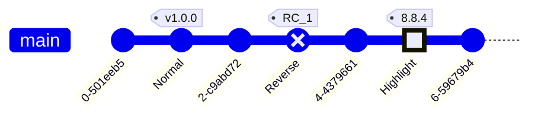

# 画图工具mermaid的支持

## 代码

```java
@PostMapping("/orderList2-body")
@ApiOperation(value = "LocalDateTime测试1")
public ResponseEntity<SysUserTime> orderList221(@RequestBody SysUserTime sysUser){
    return ResponseEntity.ok(sysUser);
}
```

## flow

```flow
st=>start: 开始框
op=>operation: 处理框
cond=>condition: 判断框(是或否?)
sub1=>subroutine: 子流程
io=>inputoutput: 输入输出框
e=>end: 结束框
st->op->cond
cond(yes)->io->e
cond(no)->sub1(right)->op
```

## 流程图flowchart


**1、简单的：**


**2.复杂的**


**3、再复杂一点**


## 时序图Sequence

1.simple


**2。simple2**


## UML类图

1.simple


2.simple


## State

1.simple


2.simple


3.simple


## Entity

1.simple


2.simiple22


## [User Journey Diagram](https://mermaid-js.github.io/mermaid/#/user-journey?id=user-journey-diagram)


1.simple


## 甘特图

1.simple


## Pie

1.simple


## Requirement

1.simpel


## Git

simple



2.simple


## C4C

1.simple

